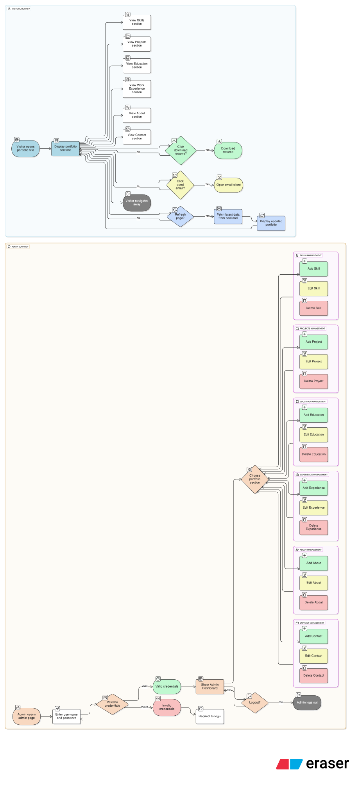
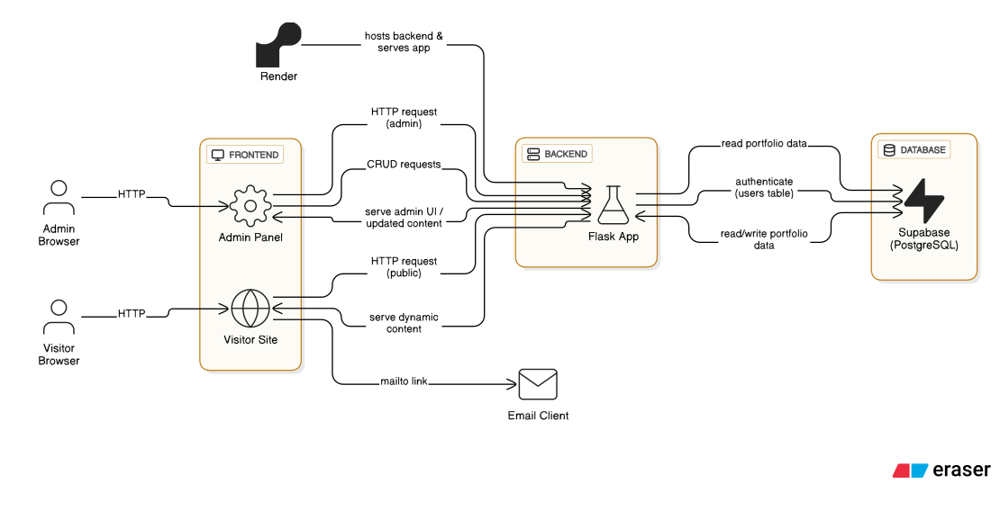

# My Portfolio

**Live Demo:** [https://my-portfolio-5lx5.onrender.com](https://my-portfolio-5lx5.onrender.com)

A fully responsive and dynamic personal portfolio website built using **Flask**, **Bootstrap**, and **Supabase (PostgreSQL)** to showcase skills, education, experience, and projects with a secure admin dashboard for content management.

---

## 🚀 Features

- 🏠 **Landing Page** with typewriter effect on mobile devices
- 🧠 **Skills**, 🛠️ **Projects**, 🎓 **Education**, 👔 **Experience**, 🙋‍♂️ **About**, and ✉️ **Contact** sections
- 🧑‍💻 **Admin Dashboard** to add, update, delete all portfolio content
- 📦 **Supabase** integration for database storage and CRUD operations
- 🔐 Login system for secure admin access
- 📱 Fully responsive with smooth navigation and modern design

---

## Flowchart

Here’s the user flow of the application:



---

## High-level System Design

This diagram shows the overall architecture of the Portfolio website, including frontend, backend, database, and email notification flows:



---

## 🧰 Tech Stack

- **Frontend:** HTML5, CSS3, Bootstrap 5
- **Backend:** Python, Flask
- **Database:** Supabase (PostgreSQL)
- **Deployment:** Render

---

## 📁 Project Structure
```
My-Portfolio/
├── app.py               # Main Flask app with route handling
├── requirements.txt     # List of Python dependencies
├── supabase_client.py   # Supabase client setup
├── static/              # CSS, JS, and image files
├── templates/           # HTML templates using Jinja2
│   ├── home.html
│   ├── login.html
│   ├── admin.html
│   ├── add.html
│   ├── edit.html
│   └── view.html
└── README.md            # Project documentation

```
